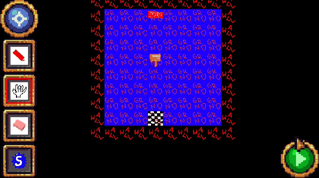
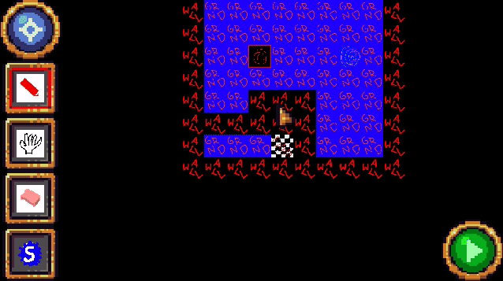

<h2> Using: </h2>
- Kotlin
- LibGdx
- ZXING
- Krita

<h2> Completed features: </h2>
- Game Engine
- Level Builder
    - Compress Level
    - Save and Load
    - View as QR Code
- Load from QR Code
    - Zxing Integrated
- Share Maps
    - Android Intents integrated
- No need to Install: Stream the game
    - Android instant integrated (unstable)

<h2> Open-Source Graphic Providers (thanks to):</h2>
- [Jeromes Fantasy Tileset](https://opengameart.org/content/16x16-fantasy-tileset) ([CC BY-SA 3.0](https://creativecommons.org/licenses/by-sa/3.0/))
- [Buchs Golden UI](https://opengameart.org/content/32x32-fantasy-tileset) ([CC0 1.0](https://creativecommons.org/publicdomain/zero/1.0/))

<h1> Devlog: </h1>
Base engine is done; all graphics are place holders or Public domain.

<h2> January </h2>
Remade graphics.

(img down-scaled to decrease size)

<h2> December </h2>
Fixed lots of bugs. Finished most transitions (swipe gestures).

<h2> November </h2>
Main Menu and Pack Select added: All base Navigation's and transitions animations are done.

<h2> September </h2>

<h3> Android compatibility </h3>
New Features include: Touchpad, full navigation, navigation animations and Kotlin code improvements.

<h3>Added mutable Tiles</h3>
Tiles are now connectable!

<h2> October </h2>

<h3>Tile Settings Editor Added</h3>
A tiles settings can now be manipulated using a simple tile dependent UI.

<h3>Configured all Tiles</h3>
All tiles (except for the checkpoint) are fully implemented and working.

<h3> Added Portal Tile </h3>
Teleport anywhere on the map using this tile.

<h3> UI advances and test-playing </h3>
Now a map can be played directly from the editor. Also item views and counters have been added.

<h3> Message handling implemented </h3>
Created a animated message dialog and am message dialog queue which is handled by the game map.

<h3> Intents up and running. </h3>
Share your self build level over a messenger application for all your friends to play! 

<h2> September </h2>

<h3> Functional Level Editor Done </h3>
All payers will be able to design and share their own maps.

<h3> Basic Game Play Finished </h3>
Collision detection and tile interactions are implemented.
Next Up: Configuring the Parts.

