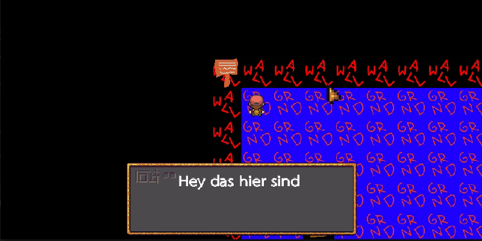
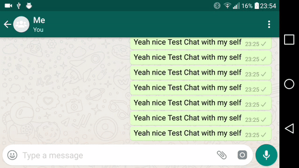

<h1> Devlog: </h1>
Base engine is done; all Grafics are place holders or Public domain.

<h2> October </h2>

<h3> Message handling implemented </h3>
Created a animated message dialog and am message dialog queue which is handled by the game map.

<h3> Intents up and running. </h3>
Share your self build level over a messenger application for all your friends to play! 

<h2> September </h2>

<h3> Functional Level Editor Done </h3>
All payers will be able to design and share their own maps.

<h3> Basic Game Play Finished </h3>
Collision detection and tile interactions are implemented.
Next Up: Configuring the Parts.

