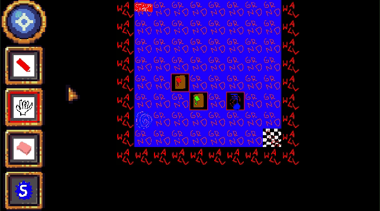

<h2> Useing: </h2>
- Kotlin
- LibGdx
- ZXING
- Krita

<h2> Completed features: </h2>
- Game Engine
- Level Builder
 - Compress Level
 - Save and Load
 - View as QR Code
- Load from QR Code
 - Zxing Integrated
- Share Maps
 - Android Intents integrated
- No need to Install: Stream the game
 - Android instant integrated (unstable)

<h1> Devlog: </h1>
Base engine is done; all Graphics are place holders or Public domain.

<h2> September </h2>

<h3> Android compatibility </h3>
New Features include: Touchpad, full navigation, navigation animations and Kotlin code improvements.

<h3>Added mutable Tiles</h3>
Tiles are now connectable!

<h2> October </h2>

<h3>Tile Settings Editor Added</h3>
A tiles settings can now be manipulated using a simple tile dependent UI.

<h3>Configured all Tiles</h3>
All tiles (except for the checkpoint) are fully implemented and working.

<h3> Added Portal Tile </h3>
Teleport anywhere on the map using this tile.

<h3> UI advances and test-playing </h3>
Now a map can be played directly from the editor. Also item views and counters have been added.

<h3> Message handling implemented </h3>
Created a animated message dialog and am message dialog queue which is handled by the game map.

<h3> Intents up and running. </h3>
Share your self build level over a messenger application for all your friends to play! 

<h2> September </h2>

<h3> Functional Level Editor Done </h3>
All payers will be able to design and share their own maps.

<h3> Basic Game Play Finished </h3>
Collision detection and tile interactions are implemented.
Next Up: Configuring the Parts.

